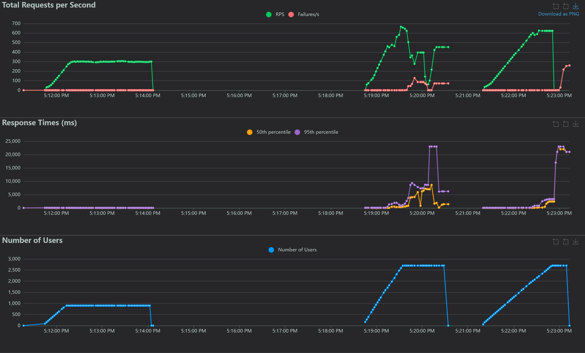
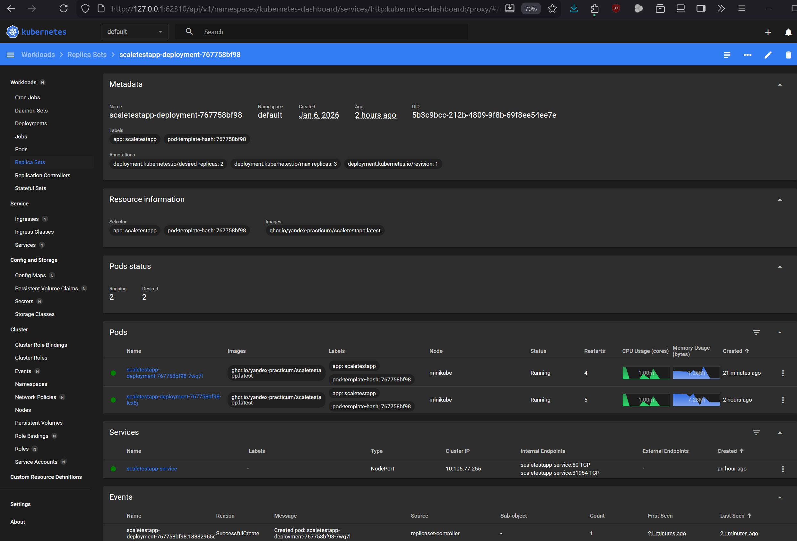
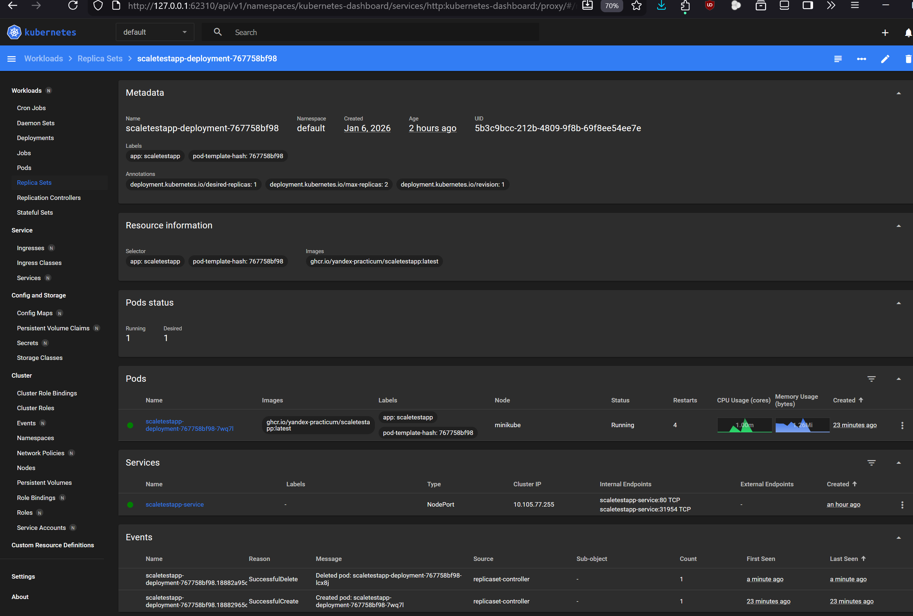

# Task-2: Динамическое масштабирование контейнеров

## Отчет

Успешно проведены тесты масштабирования кластера под нагрузкой

## Locust report


* [Locust-отчет](Locust_2026-01-06-17h21_locustfile.py_http___172.20.23.69_31954_.html)

## Minikube dashboard

Масштабирование числа подсов



## Запуск теста hpa-масштабирования кластера

### 
```bash
# ### Запуск тестов
locust -f locustfile.py --host=http://172.20.23.69:31954/

# ### metrics-server
minikube addons enable metrics-server
#💡  metrics-server is an addon maintained by Kubernetes. For any concerns contact minikube on GitHub.
#You can view the list of minikube maintainers at: https://github.com/kubernetes/minikube/blob/master/OWNERS
#    ▪ Используется образ registry.k8s.io/metrics-server/metrics-server:v0.8.0
#🌟  The 'metrics-server' addon is enabled
minikube service scaletestapp-service  --url
# http://172.20.23.69:31954
# # Идентификатор пода: scaletestapp-deployment-767758bf98-lcx8j


# ### Проверки Применения манифестов
kubectl get hpa
kubectl get svc
kubectl get deployments
kubectl top pods

# ### Применение манифестов
kubectl apply -f deployment.yaml
kubectl apply -f service.yaml
kubectl apply -f hpa.yaml

cd C:\h\a\f\software-architect-cource\labs\sprint-8\architecture-insuretech


# ### Развертывание кластера
minikube dashboard
#🤔  Verifying dashboard health ...
#🚀  Launching proxy ...
#🤔  Verifying proxy health ...
#🎉  Opening http://127.0.0.1:49970/api/v1/namespaces/kubernetes-dashboard/services/http:kubernetes-dashboard:/proxy/ in your default browser...
kubectl cluster-info
#Kubernetes control plane is running at https://172.20.23.69:8443
#CoreDNS is running at https://172.20.23.69:8443/api/v1/namespaces/kube-system/services/kube-dns:dns/proxy
#To further debug and diagnose cluster problems, use 'kubectl cluster-info dump'.


minikube addons enable metrics-server
#You can view the list of minikube maintainers at: https://github.com/kubernetes/minikube/blob/master/OWNERS
#    ▪ Используется образ registry.k8s.io/metrics-server/metrics-server:v0.8.0
#🌟  The 'metrics-server' addon is enabled
minikube start

kubectl top pods
NAME                                       CPU(cores)   MEMORY(bytes)
scaletestapp-deployment-767758bf98-lcx8j   1m           1Mi

kubectl get deployments
kubectl get pods

docker scout quickview ghcr.io/yandex-practicum/scaletestapp:latest

docker pull ghcr.io/yandex-practicum/scaletestapp:latest
#oras pull ghcr.io/yandex-practicum/scaletestapp@sha256-eff20ae3ae2d596375f9ed6d612a78d149a35a66cd2907ea90d7175ca918c993
#winget install oras

# fix with https://github.com/oras-project/oras
docker pull ghcr.io/yandex-practicum/scaletestapp:sha256-eff20ae3ae2d596375f9ed6d612a78d149a35a66cd2907ea90d7175ca918c993.sig
# sha256-eff20ae3ae2d596375f9ed6d612a78d149a35a66cd2907ea90d7175ca918c993.sig: Pulling from yandex-practicum/scaletestapp
# unsupported media type application/vnd.dev.cosign.simplesigning.v1+json

kubectl delete -f deployment.yaml
# deployment.apps "scaletestapp-deployment" deleted from default namespace

kubectl get pods
# NAME                                       READY   STATUS         RESTARTS   AGE
# scaletestapp-deployment-58bd9d9896-kws27   0/1     ErrImagePull   0          45s

kubectl apply -f deployment.yaml
# deployment.apps/scaletestapp-deployment created
cd /C/h/a/f/software-architect-cource/labs/sprint-8/architecture-insuretech/Task2

kubectl get pods -n kube-system | grep metrics-server
# metrics-server-85b7d694d7-zsznf    1/1     Running   0             4m13s

minikube addons enable metrics-server
#    ▪ Используется образ registry.k8s.io/metrics-server/metrics-server:v0.8.0
#🌟  The 'metrics-server' addon is enabled

kubectl cluster-info
# Kubernetes control plane is running at https://172.20.22.218:8443
# CoreDNS is running at https://172.20.22.218:8443/api/v1/namespaces/kube-system/services/kube-dns:dns/proxy
# To further debug and diagnose cluster problems, use 'kubectl cluster-info dump'.
```