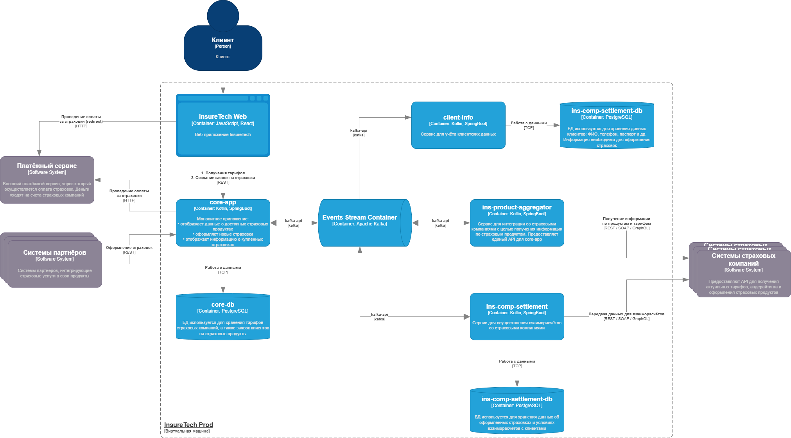

## Проблемы и риски при росте нагрузки

**Проблема 1: Рост частоты запросов к `core-app`**

Сейчас:
- `ins-product-aggregator` — раз в 15 минут
- `ins-comp-settlement` — раз в сутки + 1 раз в сутки по REST
- После 5 новых компаний → **6× запросов в день** от каждого → **всего 36× в день**
Это может привести к:
- Перегрузке `core-app`
- Задержкам в обработке
- Падению производительности

** Проблема 2: Синхронные REST-запросы создают жёсткую зависимость**

- `ins-comp-settlement` делает **синхронный REST-запрос** к `core-app` → ждёт ответа
- Если `core-app` упадёт или замедлится → `ins-comp-settlement` тоже зависнет

**Проблема 3: Нет агрегации данных по компаниям**

- Каждая компания будет делать свой запрос → **дублирование логики**
- Невозможно получить общую картину без централизованного сбора

**Проблема 4: Потеря данных при сбое**

- Если `ins-comp-settlement` не получит данные из `core-app` — они могут быть потеряны
- Нет механизма повторных попыток или буферизации

**Проблема 5: Нет масштабируемости**
- Синхронные вызовы не масштабируются — каждый новый клиент добавляет нагрузку

## Предложения по решению

### I. Внедрить Event-Streaming

Используем **Kafka** для передачи событий по причинам деление потоков на топики, поддержку consumer-групп, хранения истории событий.

Изменения:

| Взаимодействие                                             | Было                | Стало                                                     |
| ---------------------------------------------------------- | ------------------- | --------------------------------------------------------- |
| `ins-product-aggregator → core-app`                        | Раз в 15 мин → REST | `core-app` публикует событие `ProductAggregated`          |
| `ins-comp-settlement → core-app`                           | Раз в сутки → REST  | `core-app` публикует `InsuranceCreated`                   |
| `ins-comp-settlement → core-app` (для получения страховок) | Синхронный REST     | `ins-comp-settlement` подписывается на `InsuranceCreated` |

**Преимущества:**
- Уменьшение нагрузки на `core-app`
- Асинхронность — нет блокировки
- Масштабируемость — можно добавить 50+ компаний
- Гарантия доставки (если использовать Kafka)
- Логирование событий — удобно для аналитики

**Архитектура приложения после рефакторинга**

Диаграмма контейнеров to-be

---

### II. Использовать Transactional Outbox

Для обеспечения **атомарности** между записью в БД и отправкой события данные будут асинхронно передавать из Таблица outbox_events в Kafka

**Преимущества:**
- Гарантированная доставка событий
- Согласованность: если запись в БД не удалась — событие не отправлено
- Нет потери данных при сбое

---
